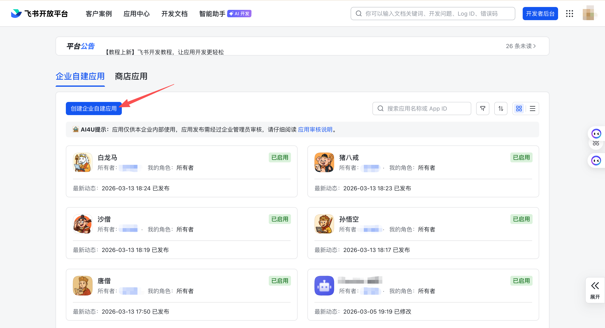
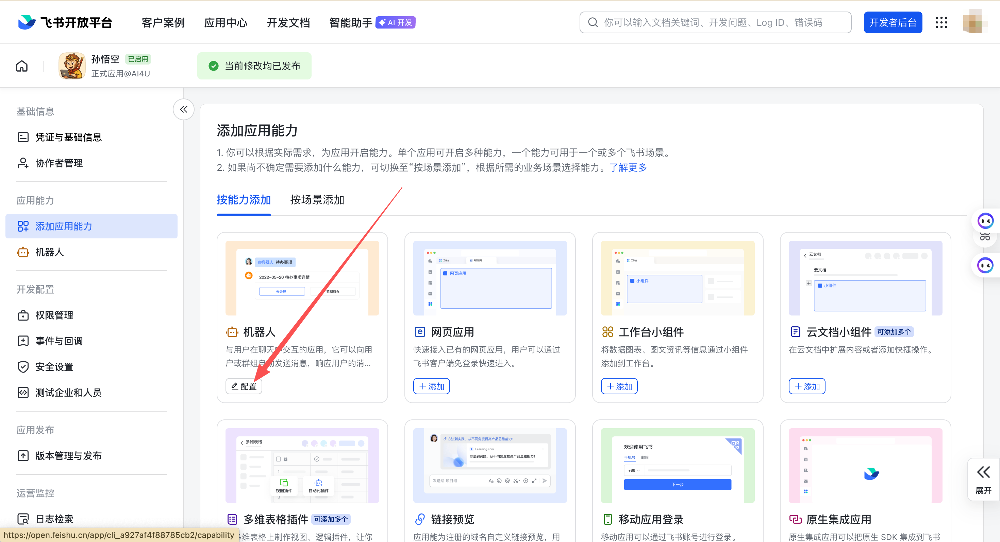
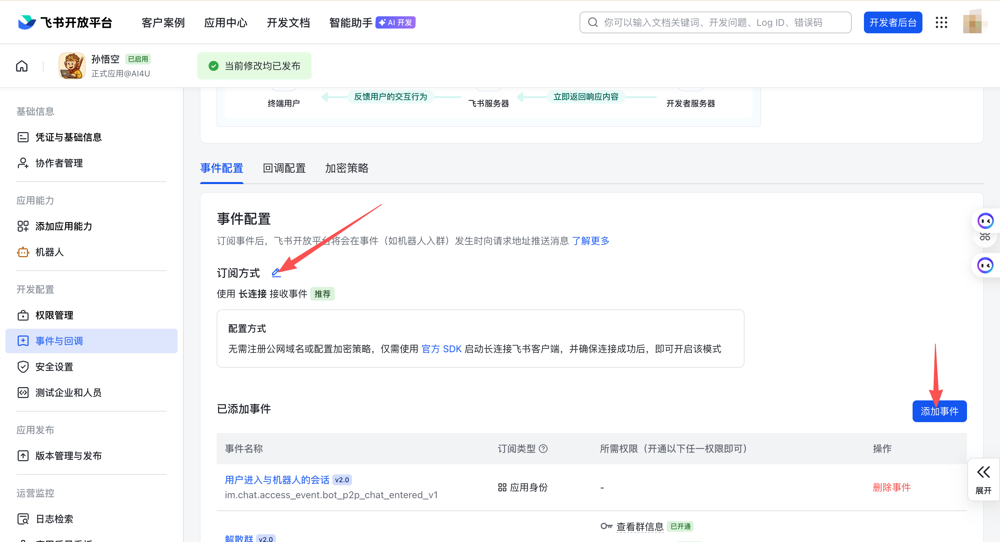
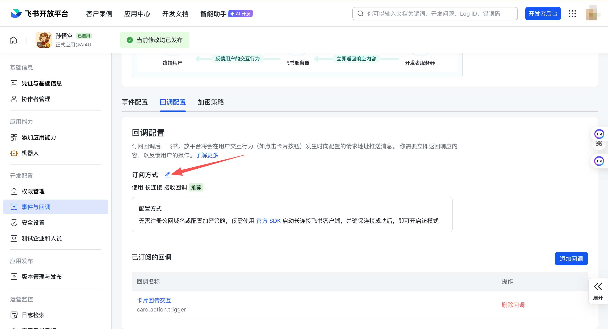
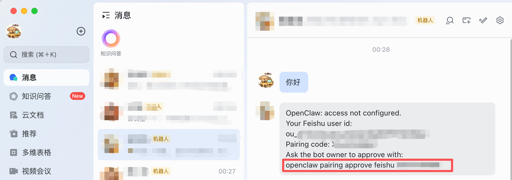

# OpenClaw + 飞书机器人

考虑“安全性”，避免出现 openclaw 误删除本地文件等问题，建议在虚拟机/容器中安装 openclaw。我的安装是在容器中进行，使用的是 docker。

## 准备工作

- 一台具有操作系统(Linux/Windows/MacOS)的物理机/虚拟机/容器
- 联网功能畅通

为了考虑安全，我选择的是 ubuntu-desktop 镜像系统，既可以作为桌面使用（在必要时候，可以通过 VNC 进行界面交互），也具有完整的操作系统功能。

## 安装步骤

安装流程包括：

> 飞书开放平台开发者后台创建机器人 --> 安装 OpenClaw & 配置 --> 飞书开放平台开发者配置事件 --> OpenClaw 配对授权


### 飞书开放平台开发者后台创建机器人

1. 登录[飞书开放平台开发者后台](https://open.feishu.cn/app).



2. 点击“创建企业自建应用”，补充机器人名字和描述以后，“创建”机器人，在「添加应用能力」页面“添加”机器人能力。



3. 在「凭证与基础信息」，获取“App ID”和“App Secret”，这是后续配置OpenClaw的关键信息。
4. 在「权限管理」中批量导入所需权限（`im:message:send_as_bot`、`im:message.p2p_msg:readonly` 等），也可以点击一键导入下面的json：

```json
{
  "scopes": {
    "tenant": [
      "bitable:app",
      "bitable:app:readonly",
      "board:whiteboard:node:create",
      "board:whiteboard:node:delete",
      "board:whiteboard:node:read",
      "board:whiteboard:node:update",
      "calendar:calendar.acl:read",
      "calendar:calendar:readonly",
      "contact:contact.base:readonly",
      "docs:doc",
      "docs:doc:readonly",
      "docs:document.comment:create",
      "docs:document.comment:read",
      "docs:document.comment:update",
      "docs:document.comment:write_only",
      "docs:document.content:read",
      "docs:document.media:download",
      "docs:document.media:upload",
      "docs:document.subscription",
      "docs:document.subscription:read",
      "docs:document:copy",
      "docs:document:export",
      "docs:document:import",
      "docs:event.document_deleted:read",
      "docs:event.document_edited:read",
      "docs:event.document_opened:read",
      "docs:event:subscribe",
      "docs:permission.member",
      "docs:permission.member:auth",
      "docs:permission.member:create",
      "docs:permission.member:delete",
      "docs:permission.member:readonly",
      "docs:permission.member:retrieve",
      "docs:permission.member:transfer",
      "docs:permission.member:update",
      "docs:permission.setting",
      "docs:permission.setting:read",
      "docs:permission.setting:readonly",
      "docs:permission.setting:write_only",
      "docx:document",
      "docx:document.block:convert",
      "docx:document:create",
      "docx:document:readonly",
      "docx:document:write_only",
      "drive:drive",
      "drive:drive.metadata:readonly",
      "drive:drive.search:readonly",
      "drive:drive:readonly",
      "drive:drive:version",
      "drive:drive:version:readonly",
      "drive:export:readonly",
      "drive:file",
      "drive:file.like:readonly",
      "drive:file.meta.sec_label.read_only",
      "drive:file:download",
      "drive:file:readonly",
      "drive:file:upload",
      "drive:file:view_record:readonly",
      "im:app_feed_card:write",
      "im:biz_entity_tag_relation:read",
      "im:biz_entity_tag_relation:write",
      "im:chat",
      "im:chat.access_event.bot_p2p_chat:read",
      "im:chat.announcement:read",
      "im:chat.announcement:write_only",
      "im:chat.chat_pins:read",
      "im:chat.chat_pins:write_only",
      "im:chat.collab_plugins:read",
      "im:chat.collab_plugins:write_only",
      "im:chat.managers:write_only",
      "im:chat.members:bot_access",
      "im:chat.members:read",
      "im:chat.members:write_only",
      "im:chat.menu_tree:read",
      "im:chat.menu_tree:write_only",
      "im:chat.moderation:read",
      "im:chat.tabs:read",
      "im:chat.tabs:write_only",
      "im:chat.top_notice:write_only",
      "im:chat.widgets:read",
      "im:chat.widgets:write_only",
      "im:chat:create",
      "im:chat:delete",
      "im:chat:moderation:write_only",
      "im:chat:operate_as_owner",
      "im:chat:read",
      "im:chat:readonly",
      "im:chat:update",
      "im:datasync.feed_card.time_sensitive:write",
      "im:message",
      "im:message.group_at_msg:readonly",
      "im:message.group_msg",
      "im:message.p2p_msg:readonly",
      "im:message.pins:read",
      "im:message.pins:write_only",
      "im:message.reactions:read",
      "im:message.reactions:write_only",
      "im:message.urgent",
      "im:message.urgent.status:write",
      "im:message.urgent:phone",
      "im:message.urgent:sms",
      "im:message:readonly",
      "im:message:recall",
      "im:message:send_as_bot",
      "im:message:send_multi_depts",
      "im:message:send_multi_users",
      "im:message:send_sys_msg",
      "im:message:update",
      "im:resource",
      "im:tag:read",
      "im:tag:write",
      "im:url_preview.update",
      "im:user_agent:read",
      "sheets:spreadsheet",
      "sheets:spreadsheet.meta:read",
      "sheets:spreadsheet.meta:write_only",
      "sheets:spreadsheet:create",
      "sheets:spreadsheet:read",
      "sheets:spreadsheet:readonly",
      "sheets:spreadsheet:write_only",
      "slides:presentation:create",
      "slides:presentation:read",
      "slides:presentation:update",
      "slides:presentation:write_only",
      "space:document.event:read",
      "space:document:delete",
      "space:document:move",
      "space:document:retrieve",
      "space:document:shortcut",
      "space:folder:create",
      "wiki:member:create",
      "wiki:member:retrieve",
      "wiki:member:update",
      "wiki:node:copy",
      "wiki:node:create",
      "wiki:node:move",
      "wiki:node:read",
      "wiki:node:retrieve",
      "wiki:node:update",
      "wiki:setting:read",
      "wiki:setting:write_only",
      "wiki:space:read",
      "wiki:space:retrieve",
      "wiki:space:write_only",
      "wiki:wiki",
      "wiki:wiki:readonly"
    ],
    "user": [
      "bitable:app",
      "bitable:app:readonly",
      "board:whiteboard:node:create",
      "board:whiteboard:node:delete",
      "board:whiteboard:node:read",
      "board:whiteboard:node:update",
      "calendar:calendar.acl:read",
      "calendar:calendar:readonly",
      "contact:contact.base:readonly",
      "docs:doc",
      "docs:doc:readonly",
      "docs:document.comment:create",
      "docs:document.comment:read",
      "docs:document.comment:update",
      "docs:document.comment:write_only",
      "docs:document.content:read",
      "docs:document.media:download",
      "docs:document.media:upload",
      "docs:document.subscription",
      "docs:document.subscription:read",
      "docs:document:copy",
      "docs:document:export",
      "docs:document:import",
      "docs:event.document_deleted:read",
      "docs:event.document_edited:read",
      "docs:event.document_opened:read",
      "docs:event:subscribe",
      "docs:permission.member",
      "docs:permission.member:auth",
      "docs:permission.member:create",
      "docs:permission.member:delete",
      "docs:permission.member:readonly",
      "docs:permission.member:retrieve",
      "docs:permission.member:transfer",
      "docs:permission.member:update",
      "docs:permission.setting",
      "docs:permission.setting:read",
      "docs:permission.setting:readonly",
      "docs:permission.setting:write_only",
      "docx:document",
      "docx:document.block:convert",
      "docx:document:create",
      "docx:document:readonly",
      "docx:document:write_only",
      "drive:drive",
      "drive:drive.metadata:readonly",
      "drive:drive.search:readonly",
      "drive:drive:readonly",
      "drive:drive:version",
      "drive:drive:version:readonly",
      "drive:export:readonly",
      "drive:file",
      "drive:file.like:readonly",
      "drive:file.meta.sec_label.read_only",
      "drive:file:download",
      "drive:file:readonly",
      "drive:file:upload",
      "drive:file:view_record:readonly",
      "im:chat",
      "im:chat.access_event.bot_p2p_chat:read",
      "im:chat.announcement:read",
      "im:chat.announcement:write_only",
      "im:chat.chat_pins:read",
      "im:chat.chat_pins:write_only",
      "im:chat.collab_plugins:read",
      "im:chat.collab_plugins:write_only",
      "im:chat.managers:write_only",
      "im:chat.members:read",
      "im:chat.members:write_only",
      "im:chat.moderation:read",
      "im:chat.tabs:read",
      "im:chat.tabs:write_only",
      "im:chat.top_notice:write_only",
      "im:chat:delete",
      "im:chat:moderation:write_only",
      "im:chat:read",
      "im:chat:readonly",
      "im:chat:update",
      "im:message",
      "im:message.group_msg:get_as_user",
      "im:message.p2p_msg:get_as_user",
      "im:message.pins:read",
      "im:message.pins:write_only",
      "im:message.reactions:read",
      "im:message.reactions:write_only",
      "im:message.send_as_user",
      "im:message.urgent.status:write",
      "im:message:readonly",
      "im:message:recall",
      "im:message:update",
      "sheets:spreadsheet",
      "sheets:spreadsheet.meta:read",
      "sheets:spreadsheet.meta:write_only",
      "sheets:spreadsheet:create",
      "sheets:spreadsheet:read",
      "sheets:spreadsheet:readonly",
      "sheets:spreadsheet:write_only",
      "slides:presentation:create",
      "slides:presentation:read",
      "slides:presentation:update",
      "slides:presentation:write_only",
      "space:document.event:read",
      "space:document:delete",
      "space:document:move",
      "space:document:retrieve",
      "space:document:shortcut",
      "space:folder:create",
      "wiki:member:create",
      "wiki:member:retrieve",
      "wiki:member:update",
      "wiki:node:copy",
      "wiki:node:create",
      "wiki:node:move",
      "wiki:node:read",
      "wiki:node:retrieve",
      "wiki:node:update",
      "wiki:setting:read",
      "wiki:setting:write_only",
      "wiki:space:read",
      "wiki:space:retrieve",
      "wiki:space:write_only",
      "wiki:wiki",
      "wiki:wiki:readonly"
    ]
  }
}
```

### 安装 OpenClaw & 配置

接下来在 Ubuntu 系统内安装和配置OpenClaw。

1. **安装 Node.js 22+**

OpenClaw 要求 **Node.js 22 或更高版本**。

```bash
curl -fsSL https://deb.nodesource.com/setup_22.x | bash -
apt-get install -y nodejs

# 验证
node -v   # 应输出 v22.x.x 或更高
npm -v
```

2. **安装 OpenClaw**

推荐使用官方一键安装脚本：

```bash
curl -fsSL https://openclaw.ai/install.sh | bash
```

该脚本会自动完成：

- 检测 Node.js 版本
- 通过 npm 全局安装 OpenClaw CLI
- 启动交互式引导向导（Onboarding Wizard）

如果只想安装 CLI、跳过引导向导：

```bash
curl -fsSL https://openclaw.ai/install.sh | bash -s -- --no-onboard
```

也可以手动通过 npm 安装：

```bash
npm install -g openclaw@latest
openclaw onboard --install-daemon
```

> Note: 目前OpenClaw更新非常频繁，建议安装**最新版本**。

3. **运行引导向导（Onboarding Wizard）**

如果上一步跳过了引导，手动执行：

```bash
openclaw onboard --install-daemon
```

向导会依次引导你完成：

1. **模型与认证** — 选择 AI 模型提供商（Anthropic / OpenAI / 自定义兼容接口等），配置 API Key
2. **工作目录** — 设置 Agent 工作空间（默认 `~/.openclaw/workspace`）
3. **Gateway 配置** — 端口（默认 `18789`）、绑定地址、认证方式
4. **通讯渠道** — 选配置飞书（Feishu），输入 App ID 和 App Secret
5. **守护进程** — 安装 systemd 服务（Linux）或 LaunchAgent（macOS），实现开机自启
6. **健康检查** — 启动 Gateway 并验证运行状态

> 💡 **向导提供 QuickStart（默认配置）和 Advanced（完全自定义）两种模式**，首次安装选 QuickStart 即可。

4. **配置飞书渠道**

如果在向导中未配置飞书，可以后续单独添加：

```bash
openclaw channels add
# 选择 Feishu，输入 App ID 和 App Secret
```

5. **启动与验证**

```bash
# 查看 Gateway 状态
openclaw gateway status

# 手动启动（前台运行，调试用）
openclaw gateway --port 18789
openclaw gateway run

# 打开浏览器控制台
openclaw dashboard
# 或直接访问 http://127.0.0.1:18789/
```

验证通过后，即可在控制台 Web UI 中直接对话，或通过飞书等已配置的渠道与 Agent 交互。同时，回到**飞书开放平台开发者后台**配置事件。

### 飞书开放平台开发者后台配置事件

回到**飞书开放平台开发者后台**：

1. 在「事件与回调」中，「事件配置」选择**使用长连接接收事件**（WebSocket），添加事件 `im.message.receive_v1`



2. 在「回调配置」中，选择**使用长连接接收事件**（WebSocket）。



3. 发布版本，在「版本管理与发布」中“创建版本”，填写完整的版本号和说明后，点击“保存”。

版本发布以后，可以回到飞书查看机器人，并开始对话。

### OpenClaw 配对授权

1.获取授权秘钥。如下截图，在机器人页面可以简单发送一条消息，而后，系统会返回配对授权的秘钥。



2. 复制配对命令：`openclaw pairing approve feishu XXXXXXX` 到 ubuntu 后台终端运行：

```bash
openclaw pairing approve feishu XXXXXXXX
```

运行结束后，完成配对，可以开启 OpenClaw+Feishu 了。


## 参考链接

- [OpenClaw GitHub](https://github.com/openclaw/openclaw)
- [OpenClaw Docs](https://docs.openclaw.ai/)